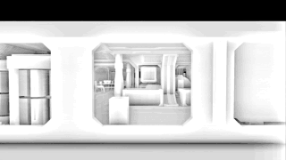
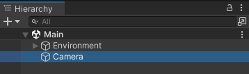
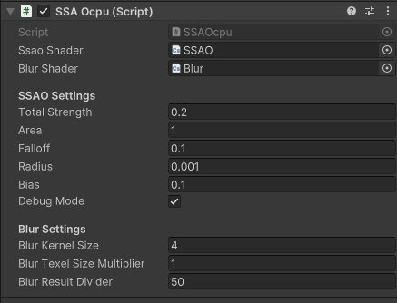

Unity version 2022.3.14f1

**SSAO Compute Shader**

**Unity | C# | Shaders | HLSL | Compute Shader**

**SSAO Compute Shader** is a great example of using a compute shader to create a Screen Space Ambient Occlusion effect in Unity. [[wiki]](https://en.wikipedia.org/wiki/Screen_space_ambient_occlusion)

Compute shaders are a type of shader used in graphics programming for general-purpose computing on graphics processing units (GPUs). Unlike traditional shaders, such as vertex or fragment shaders, which are primarily used for rendering graphics, compute shaders are designed for parallel computing tasks. They allow developers to perform highly parallel computation on the GPU, making them well-suited for a variety of non-graphics tasks.

You can learn more about compute shaders [here](https://docs.unity3d.com/Manual/class-ComputeShader.html).

---

The main logic is contained within the script called *SSAOcpu.cs* (Under Assets/Code). Here's a step-by-step explanation of how it works:

**1. Initialization Phase:**

* The script initializes the camera and sets it up to capture depth and normal information, which is crucial for ambient occlusion calculations.
* It creates two RenderTextures to store the intermediate results of the SSAO and blur operations.
* A 4x4 texture with random colors is generated to introduce randomness into the SSAO calculations.
* A list of 128 random vectors is created and used as samples for the SSAO algorithm.
* The script retrieves the indices of compute shader kernels for both the SSAO and blur shaders.

**2. SSAO Shader Setup:**

* The script defines various parameters that control the SSAO effect, such as strength, base, area, falloff, radius, bias, threshold, and a debug mode toggle.

**3. UpdateSSAOShaderValues Method:**

* This method is called before dispatching the SSAO compute shader.
* It sets up textures, parameters, and data needed for the SSAO computation.
* Matrices related to camera projection and view are set to ensure proper transformation.
* The SSAO compute shader is dispatched to perform the actual computation.

**4. Blur Shader Setup:**

* The script defines parameters for the blur effect, such as kernel size, texel size multiplier, and result divider.

**5. UpdateBlurShaderValues Method:**

* This method is called before dispatching the blur compute shader.
* It sets up textures, parameters, and data needed for the blur computation.
* The blur compute shader is dispatched to apply the blur effect to the SSAO result.

**6. OnRenderImage Method:**

* This method is automatically called by Unity during the rendering process.
* It calls UpdateSSAOShaderValues to set up SSAO shader parameters and dispatches the SSAO compute shader.
* It calls UpdateBlurShaderValues to set up blur shader parameters and dispatches the blur compute shader.
* The final blurred result is applied to the destination RenderTexture, which is the image being rendered.
* In summary, the script initializes necessary components, sets up shaders for SSAO and blur, and then, during the rendering process, it dispatches the shaders to compute and apply ambient occlusion, resulting in a visually improved scene with realistic shadows.

---

The SSAOcpu component is attached to the Camera in the Main scene.

 

You can see and change the parameters in Inspector.

**Navigation**
Use your mouse while holding the right mouse button to rotate the camera.
Use **WASD** to move. Use **E** to move up and **Q** to move down.

Press **Space** to toggle the *debug mode* on and off.
